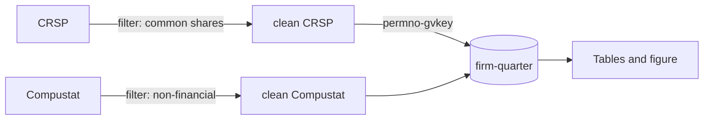

## Rule

When three or more outputs share a sample, `/ds` must plan the **smallest set of canonical analysis
datasets** that feeds them. A canonical dataset is the cleaned, joined, filtered analysis-ready file
at one declared grain. Each planned output reads a canonical dataset, never re-pulls raw data for
itself.

Before native Plan mode approval, record in the plan:

1. every canonical dataset, its grain, unique key, and input intermediates;
2. each output's canonical input; and
3. a construction diagram: raw sources → joins and filters → canonical datasets → outputs. Join
   edges name their keys; filter edges name their filters and row drops where known.

Distinct analysis grains justify distinct canonical datasets; minimal does not mean one. Carry
alternative benchmarks or windows as columns where possible rather than forks of the same grain.
For a genuine single-output pull, state why this apparatus is unnecessary.

**NO APPROVED NATIVE PLAN FOR SHARED-SAMPLE MULTI-OUTPUT WORK WITHOUT THIS DESIGN.** Independent
per-output pulls silently diverge in filters, vintages, and row counts. A canonical dataset makes
outputs tie out by construction.

## Native-plan shape

```markdown
## Canonical datasets and outputs

| Dataset | Grain | Unique key | Inputs | Outputs |
|---|---|---|---|---|
| firm-quarter | one firm-quarter | `(gvkey, yearq)` | cleaned CRSP, Compustat | summary table, regression table, coefficient figure |


```

## Facts

- Independent pulls produced Table 2 N=48,310 and Table 4 N=47,902 when each re-applied the sample
  filter. The mismatch only surfaced in review; one canonical dataset prevents it.
- Grain is a planning decision: the same sources can support firm-quarter and trade-level work. An
  unstated grain makes each implementer re-guess keys and invites join fan-out.
- A diagram without joins, filters, or their keys is decoration, not an auditable construction
  record.

If implementation discovers a necessary design change, return to native Plan mode for new approval;
do not alter the immutable copied plan.
